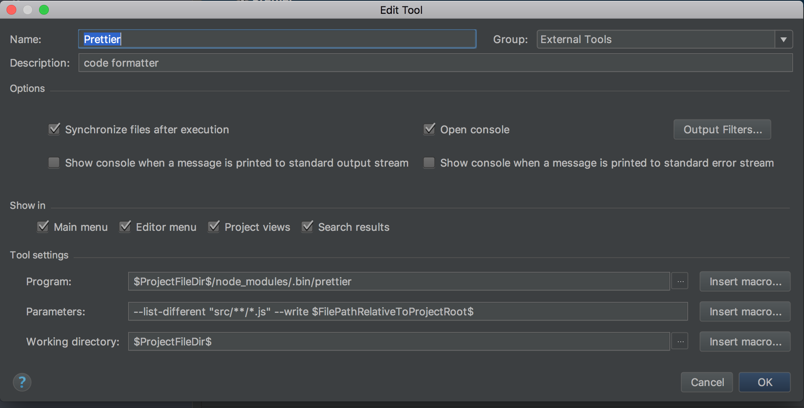
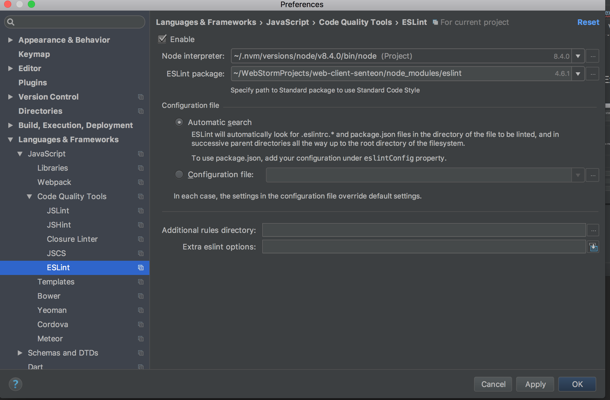

# Frontend React App 

pre-requisites: node && npm

## 1. Clone && Installation Project
  
  https:
 `git clone https://github.com/dominik-git/school-exam.git`
 
  ssh:
 `git clonegit@github.com:dominik-git/school-exam.git`
 
 2. Open project in desired enviroment (webstorm, vscode...)
 3. Use command `npm install` for installing module packages. App is located by default on `localhost:3000`.  
 4. Run application with `npm start`.   

### 2. Project configuration
 The project is using 
 
 ESLint - linter for JS code (https://eslint.org/docs/user-guide/getting-started)
                 
 Prettier : opinionated code formatter (https://github.com/prettier/prettier) 
 
 Flow : static type-check for javascript (https://flow.org/)                
 
 Flow: 
 
#### Configuration for IDE WebStorm: 
 ##### Prettier
  
  Go to : Preferences -> Tools -> External Tool -> add New tool.
   
 
 ##### Eslint
 
 Go to preferences -> Languages&frameworks -> javascript -> Code quality tools -> eslint
     1. Choose node version.
     2. Find path to ESlint
     . 
    
  ##### Flow:
 
  Go to preferences -> Languages&frameworks -> javascript -> Choose Flow as `Javascript language version`. 
  
  Check if you have path to flow node module package (Flow executable).
  
  Mark checkboxes : `type checking` and `Navigation, code completition and type hintig`
 
 ### 3. Project standards
 
 ##### 3.1 Writing redux action creators 
 (https://github.com/acdlite/flux-standard-action).
 
 
  ##### 3.2 Writing Redux structure: 
   1. constants.
   2. actions. 
   3. selectors.
   4. reducers.
    
   We are following this pattern:(https://github.com/erikras/ducks-modular-redux)
   ##### 3.3 pre-commit
   We are using pre-commit hook `husky`.
   Commited Code must pass jest tests, eslint and prettier (look at package.json file). 
